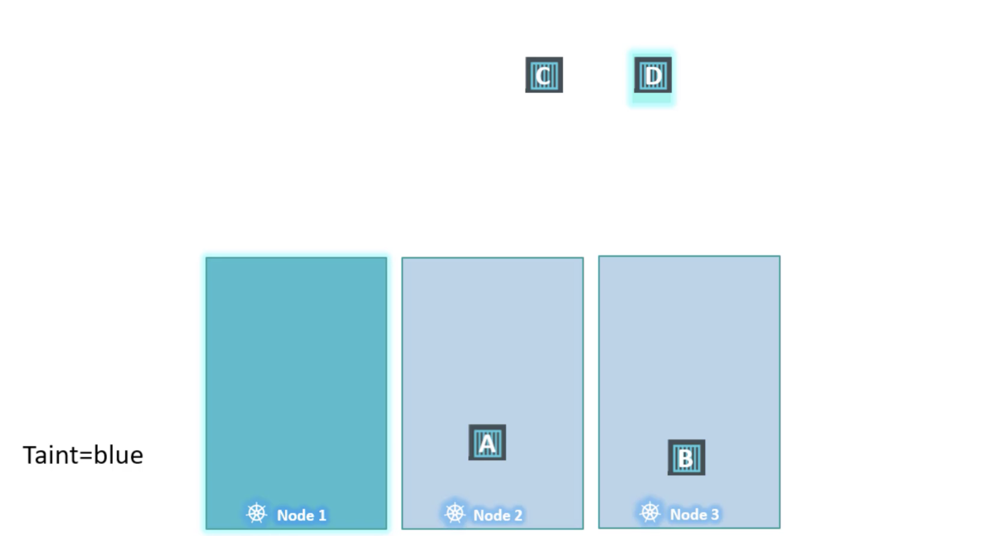

## taints 


|taint-effect|설명|
|---|---|
|NoSchedule|톨러레이션 설정이 없으면 파드를 스케쥴링하지 않습니다. 기존에 실행되던 파드에는 적용되지 않습니다.|
|PreferNoSchedule|톨러레이션 설정이 없으면 파드를 스케쥴링하지 않습니다. 하지만 클러스터안 자원이 부족하면 테인트를 설정한 노드에서도 파드를 스케쥴링할 수 있습니다.|
|NoExecute|톨러레이션 설정이 없으면 새로운 파드를 스케줄링하지 않으며, 기존 파드도 톨러레이션 설정이 없으면 종료시킵니다.|

``` sh
# 문법
kubectl taint nodes [node-name] [key]=[value]:[taint-effect]
[taint-effect] = "Noschedule | PreferNoSchedule | NoExecute"

# 예시
kubectl taint nodes node1 app=blue:NoSchedule

```

## tolerations

```yml
apiVersion: v1
kind: Pod
metadata:
  labels:
    run: nginx2
  name: nginx2
spec:
  containers:
  - image: nginx:latest
    name: nginx2
  tolertations:
  - key: "app"
    operator: "Equal"
    value: "blue"
    effect: "NoSchedule"
```

## Master Node Taint
```sh
kubectl describe node kubemaster | grep Taint

```


## etc
```sh
# 제거
kubectl taint nodes controlplane node-role.kubernetes.io/control-plane:NoSchedule-

kubectl get pods -o wide
```

